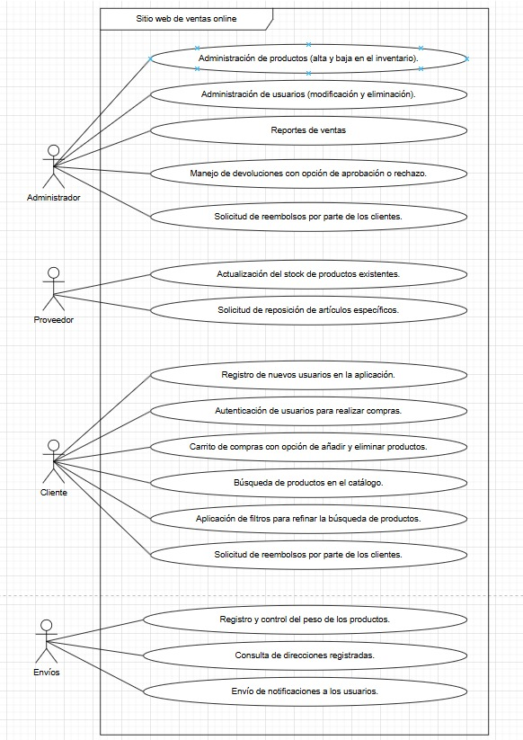

# Identificar requerimientos
# Lab Ayd
## Diego René Chen Teyul 202202882

### Requerimientos funcionales

* Administración de productos.
* Administración de usuarios
* Reportes de ventas.
* Manejo de devoluciones con opción de aprobación o rechazo.
* Actualización del stock de productos existentes.
* Solicitud de reposición de artículos específicos.
* Registro de nuevos usuarios en la aplicación.
* Autenticación de usuarios para realizar compras.
* Carrito de compras con opción de añadir y eliminar productos.
* Búsqueda de productos en el catálogo.
* Aplicación de filtros para refinar la búsqueda de productos.
* Solicitud de reembolsos por parte de los clientes.
* Registro y control del peso de los productos.
* Consulta de direcciones registradas.
* Envío de notificaciones a los usuarios.

## Requerimientos no funcionales

* Alta disponibilidad para permitir compras en cualquier momento.
* Rendimiento óptimo que garantice la experiencia e interés del cliente.
* Facilidad de mantenimiento gracias a un código claro y documentado.
* Protección de la información sensible de los usuarios y sus métodos de pago.
* Capacidad de escalar para soportar mayor cantidad de productos y clientes.
* Compatibilidad multiplataforma que facilite el uso en diversos dispositivos.

## Actores

* Administrador
* Proveedor
* Cliente
* Empresa de envíos

## Diagrama UML 

